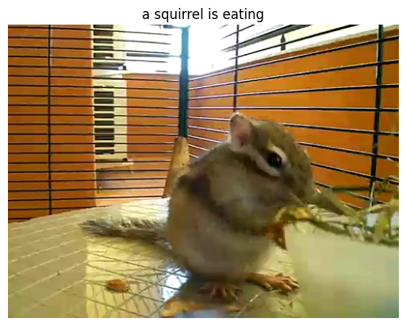

# Small video captioning transformer 

A small yet computationally efficient video captioning model with fast token processing. The project uses as base the ```small image captioning transformer``` project [1], and extentds the image captioning to videos.

Traing dataset is the MSVD captioning dataset [2].





### Model complexity

For number of 8 frames processed, with a max token leght of 100.
|Backbone|FLOPS[G]|Params[M]|
|---|---|---|
|MobileNetV2Encoder|5.92|4.78|
|CNNEncoder (resnet18 based)|33.93|33.98|


### References
[1. small_image_captioning_transformer](https://github.com/fvilmos/small_image_captioning_transformer/tree/main)
[2. MSVD](https://www.cs.utexas.edu/~ml/clamp/videoDescription/)
  

/Enjoy.
